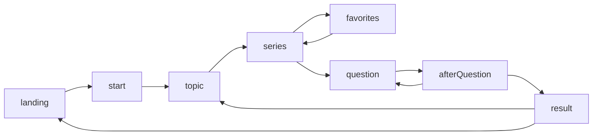

# App review and improvement plan

## Review checklist

- [ ] Walk full flow + edge cases; note mismatches vs [../docs/screens.md](../docs/screens.md)
- [ ] Keyboard + screen reader spot-check; list gaps (focus, landmarks, labels)
- [ ] Verify `../images` paths for intended open/deploy method
- [ ] Prioritize fixes: copy polish, quiz rules, architecture split, tests

---

## What you have today

The app is a **single ~1,640-line HTML file** containing CSS, embedded curriculum data (`seriesOptions`, `topicsBySeries`, `seriesArtists`), legacy placeholder quiz items (`questions`), and a **string-based state machine** (`landing` → `start` → `topic` → `series` → `question` / `afterQuestion` → `result`, plus `favorites`). Rendering is **full `innerHTML` replacement** per screen with [`escapeHtml`](../index.html) for text and a dedicated `textContent` path for explanations/insights on the feedback step—reasonable XSS hygiene.

Docs in [../docs/screens.md](../docs/screens.md) describe the intended UX; [../docs/screens flow.md](../docs/screens%20flow.md) is a “create topic” workflow for agents, not runtime code.

---

## How to run the review (process)

1. **Walk the happy path** against [../docs/screens.md](../docs/screens.md): landing → each series → one topic → flip all cards → favorites → full quiz → result → “Explore another topic” / “Start over”.
2. **Edge paths**: back from topic grid, favorites empty/full, quiz with no selection on “Next”, refresh mid-flow (expect full reset—note if that’s acceptable).
3. **Keyboard + screen reader spot-check**: tab order on landing CTA, series buttons, topic cards, flip cards (Enter/Space), quiz radios, result actions.
4. **Asset check**: images use paths like `../images/...` ([example](../index.html)); verify how you open the file (file:// vs local server vs deploy root) so paths resolve.
5. **Data vs UX spec**: compare copy, number of artworks per series, and quiz behavior to the docs.

---

## Improvement areas (prioritized)

### 1. Product and UX polish

- **Remove or replace dev-facing labels** in the UI (`"Question screen"`, `"Result screen"`, raw `"Explanation"` / `"Curator insight"` headers) with learner-facing copy consistent with the tone on the landing page.
- **Quiz flow**: consider disabling “Next” until an option is chosen, or an explicit “Skip” path; clarify what happens when nothing is selected (currently stored as empty string).
- **Navigation**: no in-quiz “Back”; users who mis-click must complete or restart—worth a deliberate decision.
- **State name `series`**: the screen is really **topic exploration** (artwork grid); renaming in code would reduce confusion when extending flows.

### 2. Accessibility

- **Landmarks and headings**: wrap main content in `<main>`, use a single logical `<h1>` per view (or `aria-labelledby`), avoid placeholder `
` where a heading belongs.
- **Focus management**: on each `render()`, move focus to the primary heading or first interactive control so keyboard users are not lost after full DOM replacement.
- **Live regions**: optional `aria-live` for score or feedback if you want announcements without reading the whole screen.
- **Card flip**: `role="button"` and `aria-pressed` are present; verify **visible focus styles** match other controls and that flipped state is clear to non-visual users (e.g. `aria-expanded` or descriptive `aria-label`).

### 3. Architecture and maintainability

- **Monolith cost**: new topics require editing a huge inline blob; errors are easy. Splitting into **CSS file + ES modules** (`data/*.js`, `render/*.js`, `state.js`) or a minimal build step would scale content work and enable linting/formatting.
- **Single source of truth for quizzes**: `getActiveQuizQuestions()` falls back to generic `questions` (math/geography placeholders) when a topic has no **exactly five** quiz items—document this rule or relax it (e.g. `z.length > 0`) so partial topic data behaves predictably.
- **Consistency on reset**: “Start over” resets `answers` with `Array(questions.length)`; quiz initialization elsewhere uses `quizTotal()`. Aligning on one helper avoids subtle length mismatches if legacy `questions` length ever diverges from an active topic quiz.

### 4. Content and pedagogy

- Replace or narrow **placeholder quiz content** so every path reinforces “contemporary art through women artists” ([`questions` array](../index.html) is currently generic trivia).
- Ensure each **topic** that should feel complete has `quiz` length 5 (per current gate) or adjust the gate so incomplete topics don’t silently show unrelated questions.

### 5. Performance and deployment

- **Image strategy**: lazy loading is already used; consider **responsive images** (`srcset`) or WebP if assets grow.
- **Caching / versioning**: if you split files later, use cache-busting or hashed filenames for production.
- **Meta**: add `<meta name="description">` and basic social tags if this will be shared as a URL.

### 6. Quality assurance

- No automated tests today. Lightweight options: **Playwright** or **Vitest + jsdom** for state transitions and “given topic X, quiz has N questions”; manual checklist from docs for releases.

---

## Suggested outcome

After the review pass, you’ll have a short **prioritized backlog**: quick wins (copy, focus, quiz validation), medium work (module split, real quiz content), and optional hardening (tests, a11y audit with VoiceOver/NVDA). No code changes are assumed until you approve implementation priorities.
